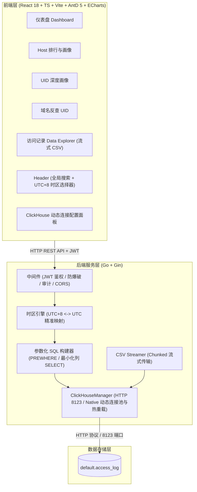

# Access Log Analytics

> 专为 ClickHouse `default.access_log` 用户访问日志量身打造的高性能、可视化查询与全链路深度分析系统。
> 原生支持通过 8123 端口 HTTP 协议连接，可在 Web 面板动态配置并热重载数据库地址。

---

## ⚡ Linux 一键安装命令 (推荐)

在任意 Linux 服务器（Ubuntu / Debian / CentOS / Rocky Linux / AlmaLinux / Alpine，x86_64 架构）上以 root 权限执行：

```bash
bash -c "$(curl -fsSL https://raw.githubusercontent.com/Grandova/across_log-panel/main/install.sh)"
```

> **自动化部署特性**：
> - 纯净直连下载，无任何第三方镜像依赖，专为海外服务器环境优化；
> - 自动释放端口与平滑替换，安装自包含前端界面的单一 Linux 二进制程序到 `/usr/local/bin/access-log-analytics`；
> - 自动注册并启动 `systemd` 后台守护服务 `access-log-analytics`（开机自启、崩溃自动重启）；
> - 安装便捷终端管理命令 `access-log`。

首次安装会在终端询问管理员用户名、新密码及确认密码，输入密码时不回显。无需手动编辑配置文件；密码仅以 Bcrypt 哈希保存。已有安装会询问是否修改账号，直接回车保留原账号和数据库配置。系统没有通用默认密码。

安装完成后直接访问：
- **Web 访问地址**：安装完成后分别显示本机、局域网、公网 IPv4 / IPv6 地址，端口使用实际配置值（默认 8080）。无法探测的地址会明确显示“未检测到”。
- **管理员登录**：使用首次安装时自行配置的账号与密码；登录后可在「系统设置 → 管理员账号」修改。
- **ClickHouse 配置**：登录后点击左侧菜单 **「系统设置」**，填写您的 ClickHouse 8123 端口地址，点击测试连接并保存即可！

---

## 🔄 一键平滑更新 / 升级

升级时重新执行安装命令，同时更新主程序和 `access-log` 管理菜单。账号修改提示处直接回车即可保留现有账号：

```bash
bash -c "$(curl -fsSL https://raw.githubusercontent.com/Grandova/across_log-panel/main/install.sh)"
```

---

### 快捷管理命令
```bash
access-log            # 打开交互式管理菜单
access-log account    # 修改/重设管理员用户名和密码（root 权限）
access-log address    # 显示局域网和公网访问地址
access-log status     # 查看当前运行状态
access-log restart    # 重启面板服务
access-log logs       # 实时跟踪运行日志
access-log stop       # 停止面板服务
access-log start      # 启动面板服务
access-log config     # 编辑环境配置文件
access-log uninstall  # 卸载面板服务
```

### 修改管理员账号或密码

- **终端**：运行 `access-log account`，输入新的用户名和密码并确认。此命令需要 root 权限，可用于忘记登录密码时重设账号；不需要旧密码。正在运行的服务会短暂停止，保存后自动启动，数据库配置保持不变。
- **网页**：进入「系统设置 → 管理员账号」，验证当前密码后保存。新密码留空可只修改用户名。
- 两种方式都会使旧登录失效，重启后仍使用新账号。密码需要 8–72 字节，终端不会打印或回显密码。

运行 `access-log address` 可重新查询访问地址。公网 IP 探测失败不会阻止安装；公网访问仍需放行配置端口，NAT 环境还需设置端口转发。

---

## 🌟 核心特性

- **专注于用户访问日志分析**：区别于通用数据库管理后台，围绕 **域名 (Host) ↔ 用户 (UID) ↔ 客户端 IP ↔ 服务节点 (Node) ↔ 原始流水** 构建闭环数据钻取。
- **全链路下钻体系 (Drill-Down Matrix)**：
  - **Host 排行**：自定义 Top N（Top 10 ~ 500 及自定义），点击任意域名直达该 Host 专属画像。
  - **Host 详情**：秒级统计总 PV、UV、IP 数、服务节点数及访问该域名的 Top UID 排行列表。
  - **UID 深度画像**：查看用户总访问量、访问过的所有 Host 排行、使用过的 IP 列表及按时间倒序的全量明细流水。
  - **域名反查 UID**：输入域名反查是哪些 UID 访问过，支持**域名及子域名自动级联匹配**（如 `youtube.com` 级联 `*.youtube.com`）、精确匹配与模糊包含匹配。
  - **IP / 节点分析**：排查某一出口/入口 IP 或节点的流量异动与关联 UID。
  - **全局智能识别搜索**：顶栏输入框自动识别数字为 UID、IPv4/IPv6 为 IP、域名为 Host，一键直达对应视图。
  - **访问日志 Data Explorer**：多条件自由组合筛选（AND），分页（50/100/200/500），单条日志抽屉展示 UTC 与 UTC+8 对比，一键复制字段。
  - **流式 CSV 导出**：基于 ClickHouse 游标的 HTTP Chunked 边查边写流式导出，支持上限 100,000 条，内存占用极低。
- **动态数据库配置与 HTTP 协议 (8123 端口)**：
  - 原生支持通过 8123 端口使用 `http_port` 方式连接 ClickHouse。
  - 支持在 Web 面板「系统设置」中**随时动态修改、即时测试并热重载**连接地址，无需重启后台服务。
- **严格时区安全处理（杜绝 8 小时时间偏移）**：
  - 数据库内部继续保持原始 UTC+0 时间，不篡改任何历史数据。
  - 前端界面所有时间输入与展示统一为 **Asia/Shanghai (UTC+8)**，明确标明时区。
  - 后端自动将用户的本地时间范围精准转换为 UTC 查询条件：`WHERE time >= ? AND time <= ?`。
- **企业级安全性**：
  - 管理员账号密码登录，密码采用 Bcrypt 加盐哈希，禁止明文。
  - 5 次登录失败触发 IP 自动锁定的防爆破机制。
  - 自动记录管理员查询审计日志（记录谁在何时查询了哪个 UID、Host、IP 或导出了日志）。
- **现代化 UI**：
  - 基于 React + TypeScript + Vite + Ant Design 5 + ECharts。
  - 完美支持 **深色模式 (Dark)** 与 **浅色模式 (Light)** 一键无缝切换。

---

## 🏗️ 架构设计



---

## 🐳 Docker 部署 (备选方式)

如果您习惯使用 Docker 部署：

```bash
git clone https://github.com/Grandova/across_log-panel.git
cd across_log-panel

# 首次启动：复制示例并填写自己的 ADMIN_USER、ADMIN_PASSWORD
cp .env.example .env
${EDITOR:-nano} .env

# 构建并启动容器
docker-compose -f deploy/docker-compose.yml up -d
```
访问：`http://服务器IP:8080`

---

## ⚙️ 配置文件说明

配置文件位于 `/opt/across_log-panel/.env`：

```env
# 服务监听端口
PORT=8080

# JWT 密钥（留空自动生成并持久化）
JWT_SECRET=

# 管理员账号与初始密码
ADMIN_USER=
ADMIN_PASSWORD=

# ClickHouse 数据库连接 (通过 8123 端口 HTTP 协议连接)
CLICKHOUSE_PROTOCOL=http
CLICKHOUSE_HOST=127.0.0.1
CLICKHOUSE_PORT=8123
CLICKHOUSE_DATABASE=default
CLICKHOUSE_USERNAME=default
CLICKHOUSE_PASSWORD=
CLICKHOUSE_SECURE=false

# 界面展示时区
APP_TIMEZONE=Asia/Shanghai
```

> **账号设置**：一键安装通过终端交互设置账号。手动或 Docker 部署首次启动时填写 `ADMIN_USER` 和 `ADMIN_PASSWORD`；初始化后只持久化密码哈希，可删除 `.env` 中的 `ADMIN_PASSWORD`。后台修改账号会立即使所有旧登录失效，重启后仍使用已保存的新账号。`data/config.json` 含私有配置，请勿上传或公开。

> **提示**：除了直接编辑 `.env` 文件，您可以在登录 Web 面板后，在 **「系统设置」** 界面直接进行可视化修改并一键测试连通性，保存后即刻热生效。

---

## 📊 典型分析场景使用流程

### 场景一：域名反向追查访问者
1. 首页 **Host 访问排行榜** 中发现异常域名（例如 `api.openai.com` 请求突增）；
2. 点击域名进入 **Host 画像详情页**，查看总 PV、涉及独立 UID 数及具体服务节点；
3. 在下方 **“访问此域名的 UID 列表”** 中，查看访问量最大的 Top UID 及其客户端 IP；
4. 点击该 UID 直接下钻至 **用户画像页**，查看其完整的网络行为记录。

### 场景二：特定用户 UID 行为排查
1. 顶栏全局搜索框直接输入 `16728`，系统自动识别为 UID 并回车跳转；
2. 查看该用户访问最多的 Top 20 Host，快速判定其主要访问业务或异常外联；
3. 查看该用户完整的时间倒序流水，点击任一行展开抽屉对比 UTC 与 UTC+8 时间戳。

### 场景三：异常 IP 或节点流量溯源
1. 在 **IP 行为分析** 输入某一客户端 IP；
2. 聚合查看该 IP 归属的全部 UID 以及发往的 Host 域名；
3. 在 **节点分析** 中查看各代理节点的吞吐量分布，发现单节点过载风险。

---

## 📈 性能与规模演进说明

- **当前规模（数十万~数百万条）**：系统直接对原始表 `default.access_log` 执行参数化聚合查询，严格使用 `PREWHERE` 命中时间主键，只检索必要列，响应均在毫秒级。
- **超大规模演进（上千万~上亿条）**：可在 `migrations/clickhouse/002_mv_hourly_stats.sql` 中启用小时级预聚合物化视图（`AggregatingMergeTree`），大盘趋势与 Top Host 查询将秒级命中物化视图，原始 UID/Host 详情与明细流水依然无缝穿透查底表。

---

## 📄 开源许可证

MIT License.
